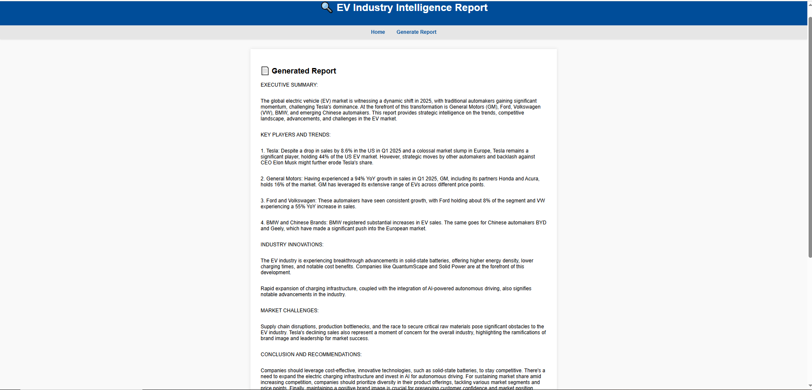
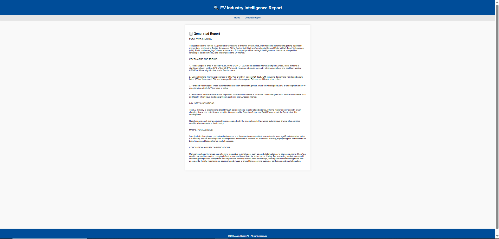

# AI-Industry-Analyst-using-LLM-and-LangChain

# 

# 

# 


# 🔍 AI Industry Analyst using LLM and LangChain

An end-to-end, fully automated AI-powered system that generates strategic industry intelligence reports using LLMs (like OpenAI's ChatGPT) and LangChain. This tool assists business leaders in understanding market trends, competitors, and emerging opportunities based on real-time data.

---

## 🚀 Features

- ✅ Accepts high-level business queries (e.g., "Generate a report on the EV market and its key players")
- 📄 Extracts and parses relevant PDFs or web content
- 🔍 Analyzes market trends, competitors, and opportunities
- 🧠 Uses LangChain and OpenAI for contextual intelligence
- 📝 Automatically generates structured strategic reports with insights and recommendations
- 🌐 Includes Flask-based API and UI support

---


## 🛠 Tech Stack

- **Python 3.10+**
- **LangChain**
- **OpenAI API (ChatGPT)**
- **BeautifulSoup + Requests (Web Scraping)**
- **PyPDFLoader (PDF Parsing)**
- **Transformers (Hugging Face Pipelines)**
- **Flask (API & UI)**

---

## ⚙️ Setup Instructions

### 1. Clone the Repository

```bash
git clone https://github.com/raselsarker69/AI-Industry-Analyst-using-LLM-and-LangChain.git
cd AI-Industry-Analyst-using-LLM-and-LangChain
```

### Create Virtual Environment & Activate
```
python -m venv venv
venv\Scripts\activate       # On Windows
# Or
source venv/bin/activate    # On Linux/Mac
```

### Install Dependencies
```
pip install -r requirements.txt
```

### 📌 Sample Output Sections
1. Executive Summary
2. Market Trends
3. Key Players & Competitor Analysis
4. SWOT or PESTEL Analysis
5. Strategic Recommendations
6. Sources & References
7. Competitor Analysis
8. Emerging Opportunities


### 📬 Future Improvements
- Integration with live financial data APIs
- Support for more industries & languages
- Interactive dashboard using Streamlit